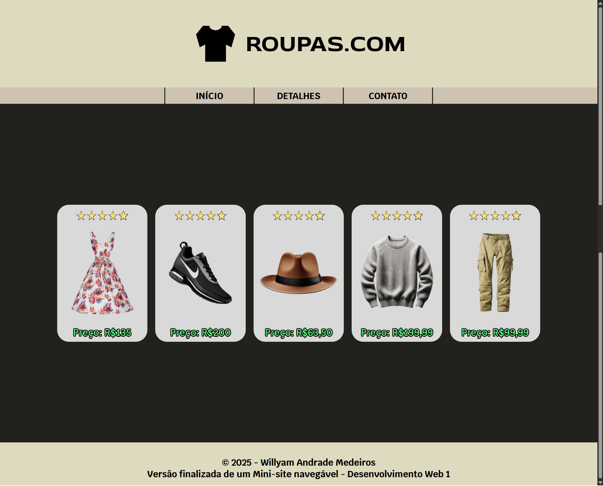
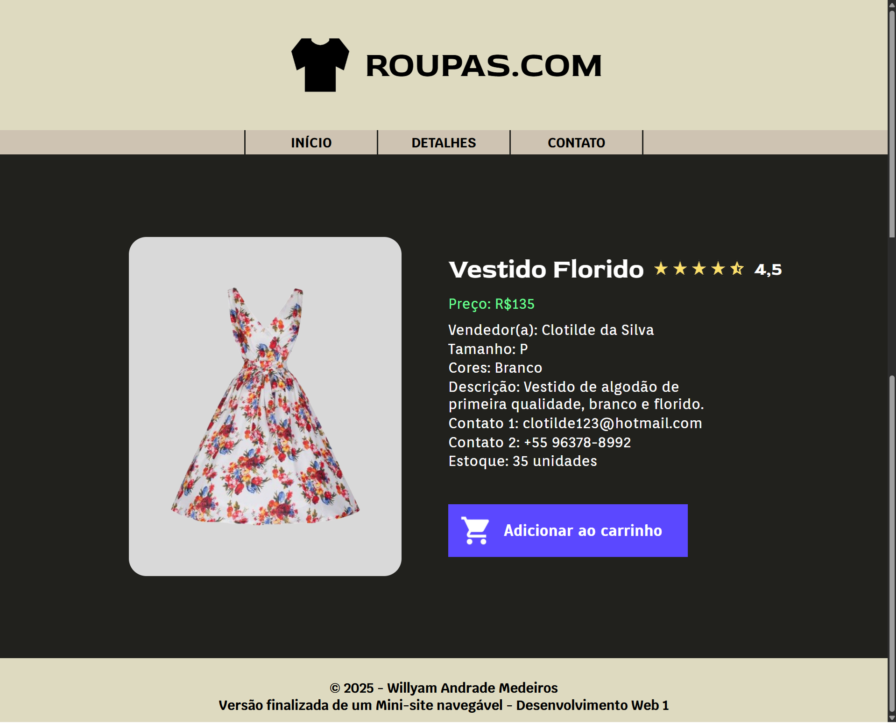
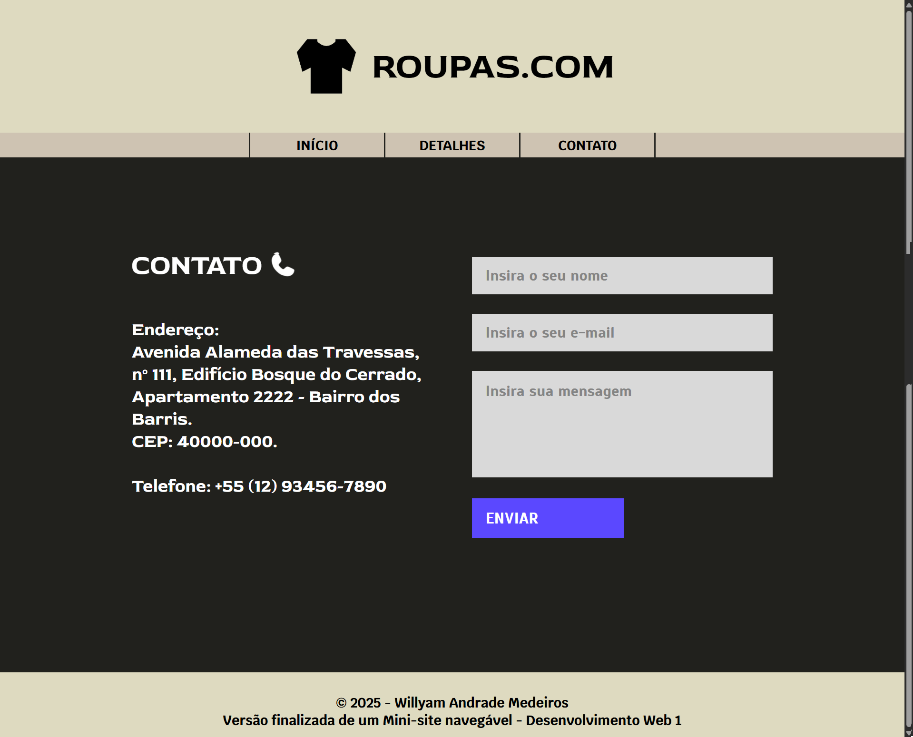

# Loja de Roupas - Desenvolvimento Web 1

**Aluno:** Willyam Andrade Medeiros  
**Semestre:** S4 2025.2

## Visualização
**Projeto de protótipo:** [Protótipo](https://www.figma.com/proto/leUJctolvcULNg06n4AsYr/Layout-Site-de-Roupas)  
**Projeto finalizado:** [Loja de Roupas](https://willyamandrade.github.io/Loja-de-Roupas-Web1/index.html)

## Página de início



## Página de detalhes



## Página de contato


 
<br>

# Diferenças:
* Como o protótipo do Figma foi desenvolvido com uma resolução de tela em mente, o conteúdo principal da versão final ficou um pouco *afastado* do header e footer;
* Algumas fontes do protótipo estavam em **"semi-negrito"**, que não existem no *HTML/CSS*, por isso alguns textos ficaram mais *"grossos"* ou *"finos"* comparados à versão original;
* Vários contaíners ficaram em posiçôes diferentes da original, pois estavam descentralizados; foram então corrigidas na versão final;
* Na página finalizada de contato, o conteúdo principal ficou mais afastado do footer em comparação com o header;
* O segundo item da página de início "bugou" no protótipo.

<br>

# Informações do projeto

```
Desenvolvimento Web I
Instituto Federal do Ceará - Campus Maranguape
Curso Técnico Integrado em Informática - prof. Thomaz Maia
```

# Projeto Final - Implementação de Protótipo do Figma

## 1 Objetivo do Projeto

Colocar em prática todos os conceitos aprendidos durante a disciplina Desenvolvimento Web, criando
um site completo em HTML e CSS com base no protótipo desenvolvido no Figma no início do semestre.  
Cada aluno (ou dupla) deverá implementar o site planejado, respeitando o design, paleta de cores e
estrutura definidos anteriormente no protótipo.

## 2 Instruções Gerais
* O site deve ser construído utilizando apenas HTML e CSS (sem JavaScript).
* A estrutura e o estilo devem respeitar o protótipo criado no Figma.
* O projeto deve conter três páginas principais:
* Página Inicial (index.html)
* Página de Detalhes (detalhes.html)
* Página de Contato (contato.html)
* O site deve ser publicado no GitHub Pages, e o link deve ser enviado como forma de entrega.

## 3 Requisitos de Estrutura

### 3.1 Páginas  

* Cada página deve ter:
    - Cabeçalho (header) com o nome do site e o menu de navegação (nav);
    - Rodapé (footer) com os nomes dos autores do projeto e o ano;
* As três páginas devem compartilhar o mesmo topo e rodapé (copiados entre os arquivos).

## 3.2 Página Inicial (index.html)

* Deve apresentar pelo menos 5 itens relacionados ao tema do site (ex: produtos, livros, jogos, etc);
* Esses itens devem ser apresentados em cards (blocos com imagem, título e uma pequena descrição);
* Utilize tags semânticas como section, article e figure para organizar o conteúdo;
* Use Flexbox para alinhar e distribuir os cards de forma responsiva.

### 3.3 Página de Detalhes (detalhes.html)
* Mostre um dos itens em destaque (um produto, livro, jogo, etc);
* Deve conter:
    - Imagem principal do item;
    - Título e descrição detalhada;
* Outras informações relevantes (ex: preço, autor, gênero, tamanho, etc);
* Organize as informações com Flexbox e Box Model para garantir bom espaçamento e legibilidade.

### 3.4 Página de Contato (contato.html)

* Deve conter um formulário de contato com os seguintes campos:
    - Nome (input type="text")
    - E-mail (input type="email")
    - Assunto (input type="text")
    - Mensagem (textarea)
    - Botão de envio (button type="submit")
* Utilize a tag <form> e associe corretamente as labels aos campos.
* Aplique estilização no formulário para deixá-lo agradável visualmente.

### 3.5 Requisitos de Estilo (CSS)

* Utilize um arquivo CSS externo (style.css).
* Use classes e IDs de forma coerente.
* Aplique:
    - Cores e tipografia com base na paleta escolhida no Figma;
    - Box model (margin, padding, border);
    - Posicionamento (ex: flex, align-items, justify-content, gap, etc);
    - Responsividade básica (o site deve se ajustar minimamente em diferentes larguras de tela).

### 3.6 Apresentação Final
Além do site publicado no GitHub Pages, o aluno deverá preparar uma pequena apresentação no
README.md do repositório trazendo:
* Imagem (print) do protótipo feito no Figma (uma captura de cada uma das três páginas).
* Imagem (print) das páginas desenvolvidas em HTML/CSS correspondentes.
* Uma breve descrição comentando as principais semelhanças e diferenças entre o design e a
implementação final.
Dica: use a ferramenta de captura do próprio computador (Print Screen) e salve as imagens dentro de uma pasta chamada img/.

### 3.7 Estrutura de pastas

```
projeto_final/  index.html
                /html/
                    detalhes.html
                    contato.html
                /css/style.css
                /img (imagens utilizadas no site)
```